# LeetCode

## Основные виды сложности(от самых быстрых к медленным)

<b>O(1)</b> — Константная: Время работы не зависит от размера данных (например, доступ к элементу массива по индексу).

<b>O(log n)</b> — Логарифмическая: Идеальная сложность. При каждом шаге количество данных сокращается вдвое, время растет медленно (например, бинарный поиск).

<b>O(n)</b> — Линейная: Время растет прямо пропорционально размеру данных. Приходится просматривать все элементы (например, поиск максимума).

<b>O(n log n)</b> — Квазилинейная: Встречается во многих продвинутых алгоритмах сортировки (например, быстрая или сортировка слиянием).

<b>O(n²)</b> — Квадратичная: Обычно возникает при наличии вложенных циклов. Эффективно работает только на небольших объемах (например, сортировка пузырьком).

<b>(O(2^n))</b> — Экспоненциальная: Время удваивается при добавлении каждого нового элемента. Применяется при переборе всех возможных вариантов.

<b>O(n!)</b> — Факториальная: Самая медленная вычислительная сложность, алгоритм становится неприменим даже для небольших массивов (например, наивный поиск решения задачи коммивояжера).

## Основные паттерны решения алгоритмических задач

### Префиксные суммы (prefix sum)
Префиксная сумма включает предварительную обработку массива для создания нового массива, где каждый элемент с индексом i представляет собой сумму массива от начала до i. Это позволяет эффективно выполнять запросы сумм к подмассивам.
 

 
<b>Когда использовать</b>: когда нужно выполнить несколько запросов сумм к подмассиву или вычислить совокупные суммы

<b>Задачи</b>
- [range_sum](./prefix_sum/range_sum.py) - рассчитывает сумму элементов массива в интервале [i, j] ([LeetCode: 303](https://leetcode.com/problems/range-sum-query-immutable/))

### Два указателя (Two pointers)
Паттерн двух указателей использует два указателя для обхода массива или списка. Часто применяется для поиска пар элементов, удовлетворяющих определённому условию.
 
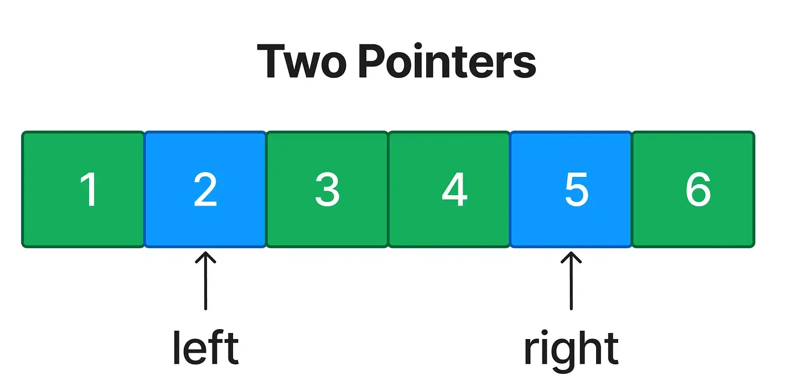
 
<b>Когда использовать</b>: при работе с отсортированными массивами или списками, где нужно найти пары, удовлетворяющие условию (например, сумма = target).

<b>Задачи</b>
- [two_sum](./two_pointers/two_sum.py) - возвращает индексы элементов массива, сумма элементов которых равна target ([LeetCode: 167](https://leetcode.com/problems/two-sum-ii-input-array-is-sorted/description/))
- [three_sum](./two_pointers/three_sum.py) - возвращает массивы из 3 элементов, сумма которых равна 0 ([LeetCode: 15](https://leetcode.com/problems/3sum/description/))

### Скользящее окно (Sliding window)
Используется для поиска подмассива или подстроки, удовлетворяющей определённому условию. 
Он оптимизирует временную сложность за счёт поддержания «окна» фиксированного или переменного размера.
 
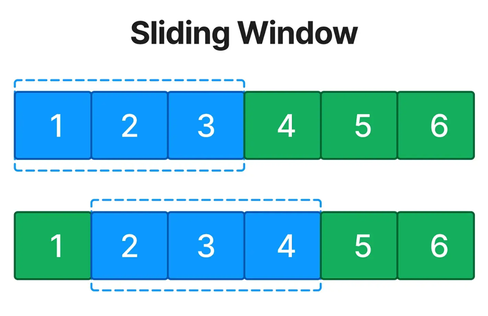
 
<b>Когда использовать</b>: при работе с непрерывными подмассивами или подстроками.

### Быстрый и медленный указатели (Fast & Slow pointers)
Этот шаблон (известен как «черепаха и заяц») используется для обнаружения циклов в связных списках и других структурах.
 
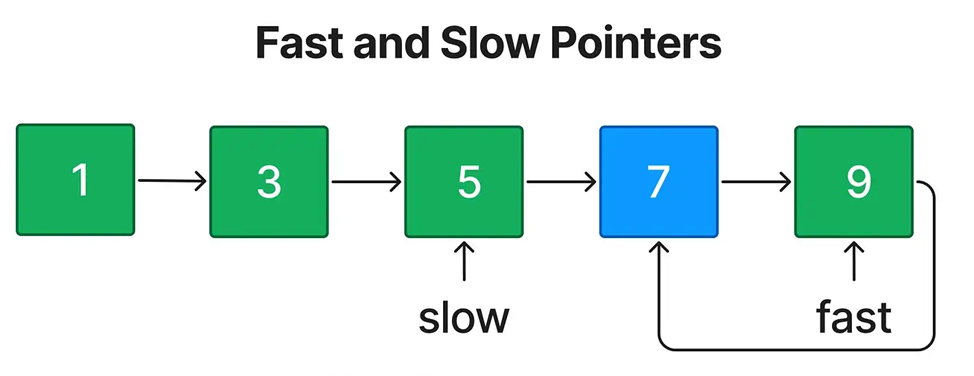
 
<b>Когда использовать</b>: когда нужно определить наличие цикла, найти середину списка или решить задачи на цикличность.

### Разворот связного списка на месте (In-place Reversal of LinkedList)
Позволяет разворачивать часть связного списка без дополнительного пространства.
 
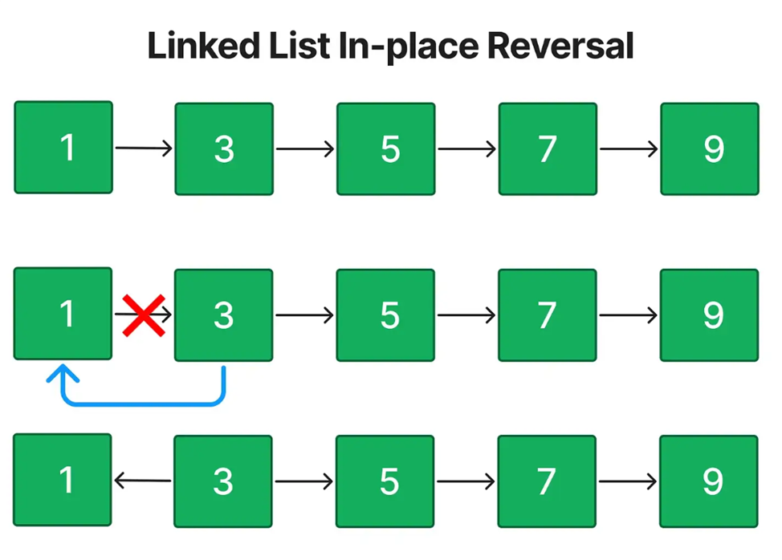
 
<b>Когда использовать</b>: когда нужно развернуть подсписок или весь список «на месте».

<b>Задачи</b>
- [reverse_list](./linked_list/reverse_list.py) - разворачивает связанный список ([LeetCode: 206](https://leetcode.com/problems/reverse-linked-list/description/))
- [reverse_list_between](./linked_list/reverse_list_between.py) - разворачивает связанный список для указанного интервала ([LeetCode: 92](https://leetcode.com/problems/reverse-linked-list-ii/description/))
- [swap_pairs](./linked_list/swap_pairs.py) - разворачивает пары элементов в связнанном списке ([LeetCode: 24](https://leetcode.com/problems/swap-nodes-in-pairs/description/))

### Монотонный стек (Monotonic Stack)
Монотонный стек поддерживает элементы в стеке в строго возрастающем или убывающем порядке. 
Часто используется для поиска следующего большего/меньшего элемента.
 
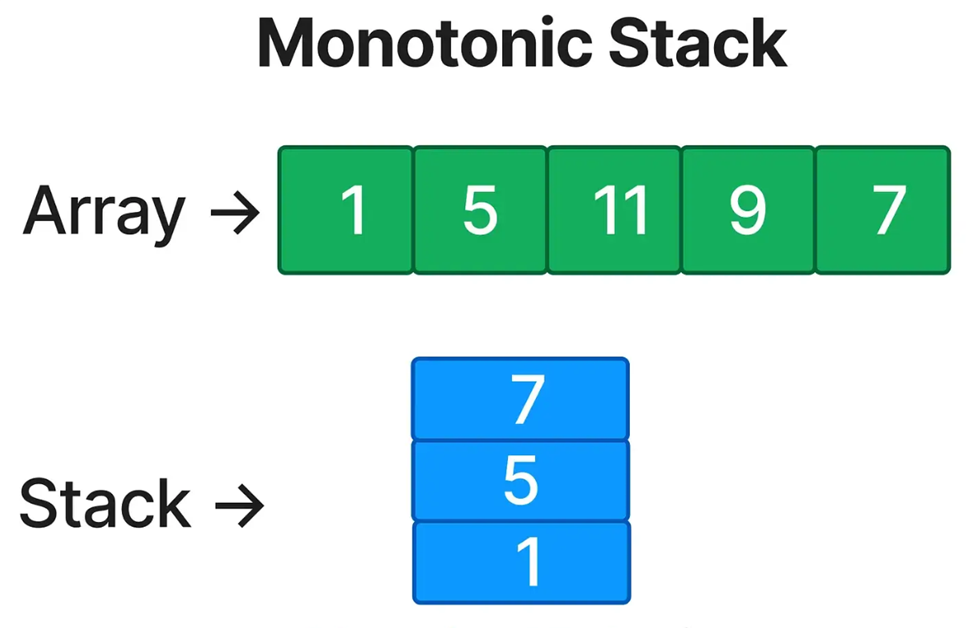
 
<b>Когда использовать</b>: когда нужно найти ближайший больший/меньший элемент слева или справа.

<b>Задачи</b>
- [next_greater_element](./monotonic_stack/next_greater_element.py) - находит следующий больший элемент из списка 2 для каждого элемента списка 1
([LeetCode: 496](https://leetcode.com/problems/next-greater-element-i/description/))
- [next_greater_element_cycle](./monotonic_stack/next_greater_element_cycle.py) - находит следующий больший элемент из списка для каждого элемента этого списка 
([LeetCode: 503](https://leetcode.com/problems/next-greater-element-ii/description/))
- [daily_temperature](./monotonic_stack/daily_temperature.py) - определяет сколько дней надо подождать, пока станет теплее 
([LeetCode: 739](https://leetcode.com/problems/daily-temperatures/description/))

### Топ K элементов (Top ‘K’ Elements)
Этот шаблон находит K наибольших или наименьших элементов с помощью куч (heap) или сортировки.
 
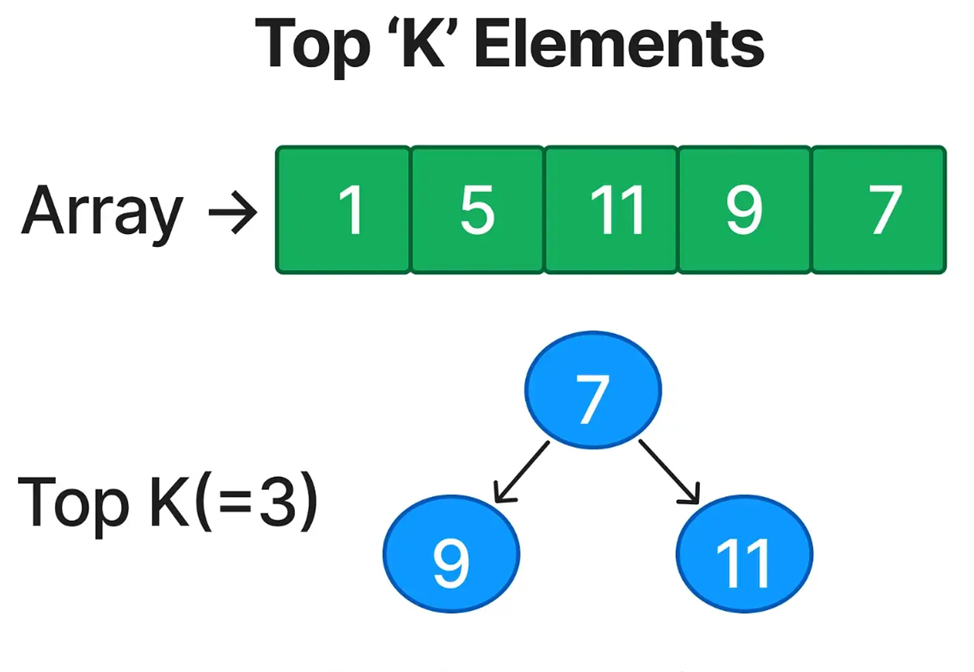
 
<b>Когда использовать</b>: при поиске медианы, топ-K элементов в потоке.

<b>Задачи</b>
- [top_k_frequent](./top_k_elements/top_k_frequent.py) - находит K наиболее часто встречающихся элементов
([LeetCode: 347](https://leetcode.com/problems/top-k-frequent-elements/description/))
- [k_largest_element](./top_k_elements/find_k_largest_element.py) - находит K-ый наибольший элемент
([LeetCode: 215](https://leetcode.com/problems/kth-largest-element-in-an-array/description/))

### Перекрывающиеся интервалы (Overlapping Intervals)
Шаблон для слияния или обработки интервалов, которые пересекаются.

Главный секрет решения 90% задач на интервалы — это предварительная сортировка. Если интервалы отсортированы по времени их начала (start), задача превращается в линейный обход.
 
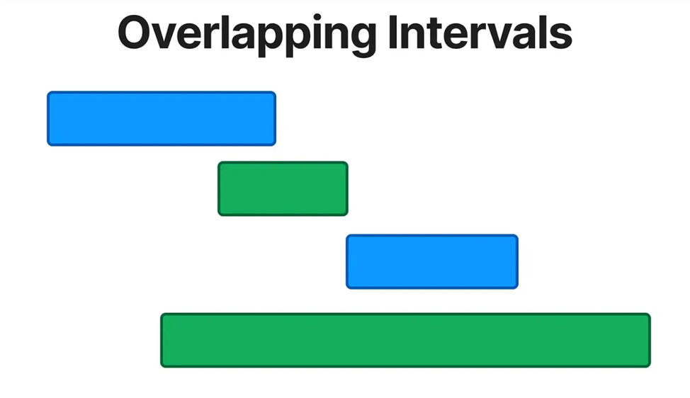
 
<b>Когда использовать</b>: при работе с графиками, расписаниями, объединением диапазонов.

<b>Задачи</b>
- [merge_intervals](./overlapping_elements/merge_intervals.py) - объединяет перекрывающиеся интервалы
([LeetCode: 56](https://leetcode.com/problems/merge-intervals/description/))
- [insert_interval](./overlapping_elements/insert_interval.py) - добавляет интервал и объединяет перекрывающиеся
([LeetCode: 57](https://leetcode.com/problems/insert-interval/description/))
- [remove_overlap_intervals](./overlapping_elements/remove_overlap_intervals.py) - возвращает минимальное кол-во интервалов, которые необходимо удалить, чтобы интервалы не пересекались.
([LeetCode: 435](https://leetcode.com/problems/non-overlapping-intervals/description/))

### Модифицированный бинарный поиск (Modified Binary Search)
Адаптация бинарного поиска для вращённых отсортированных массивов, нахождения границ и т.д.
 
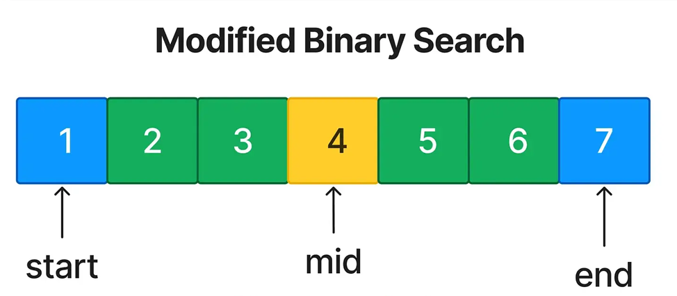
 
<b>Когда использовать</b>: при работе с отсортированными или повёрнутыми массивами и поиске элементов.

### Обход бинарного дерева (Binary Tree Traversal)
Обход всех узлов дерева в определённом порядке:
- PreOrder: корень → лево → право
- InOrder: лево → корень → право
- PostOrder: лево → право → корень
 
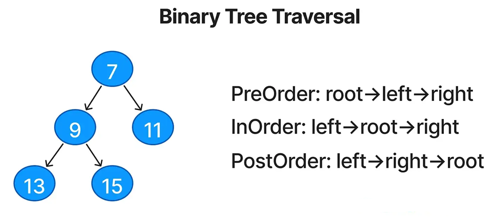
 
<b>Когда использовать</b>: почти во всех задачах на деревья.

<b>Задачи</b>
- [bianry_tree_paths](./binary_tree_traversal/bianry_tree_paths.py) - возвращает все пути обхода дерева
([LeetCode: 257](https://leetcode.com/problems/binary-tree-paths/description/))
- [kth_smallest](./binary_tree_traversal/smallest_element_bst.py) - возвращает k-ый наименьший элемент
([LeetCode: 230](https://leetcode.com/problems/kth-smallest-element-in-a-bst/description/))
- [max_path_sum](./binary_tree_traversal/maximum_path_sum.py) - возвращает максимальный путь
([LeetCode: 124](https://leetcode.com/problems/binary-tree-maximum-path-sum/description/)

### Поиск в глубину (Depth-First Search (DFS))
Погружаемся как можно глубже по одной ветке, прежде чем вернуться назад.
 
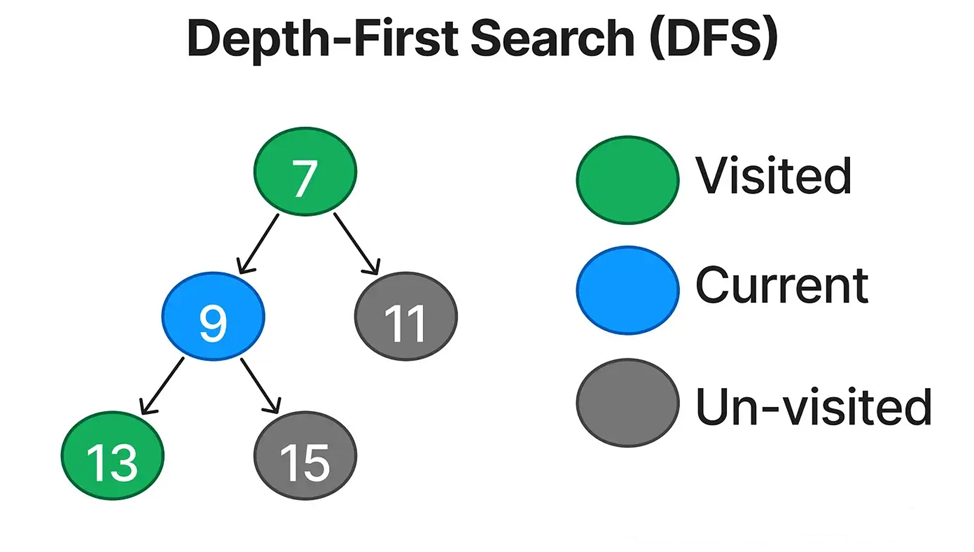
 
<b>Когда использовать</b>: для обхода всех путей, генерации комбинаций, рекурсивных задач на деревья/графы.

<b>Задачи</b>
- [clone_graph](./dfs/clone_graph.py) - возвращает клон графа
([LeetCode: 133](https://leetcode.com/problems/clone-graph/description/))
- [path_sum](./dfs/path_sum.py) - возвращает путь
([LeetCode: 113](https://leetcode.com/problems/path-sum-ii/description/))
- [course_schedule](./dfs/course_schedule.py) - определяет цикличность в графе
([LeetCode: 207](https://leetcode.com/problems/course-schedule/))
- [course_order](./dfs/course_order.py) - определяет порядок проходждения курсов
([LeetCode: 210](https://leetcode.com/problems/course-schedule-ii/description/))

### Поиск в ширину (Breadth-First Search (BFS))
Узлы исследуются уровень за уровнем в дереве или графе.
 
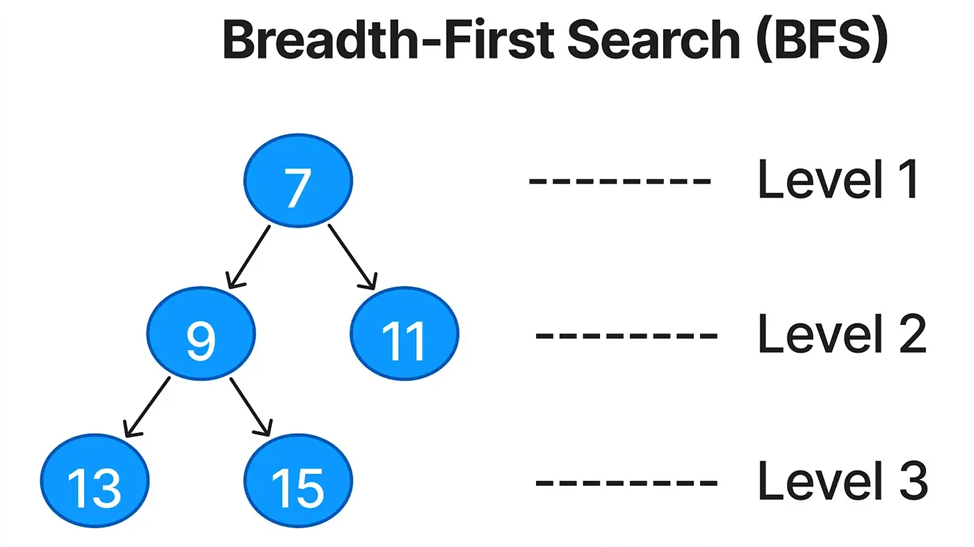
 
<b>Когда использовать</b>: для поиска кратчайшего пути в невзвешенном графе, обхода по уровням.

<b>Задачи</b>
- [level_order](./bfs/level_order.py) - возвращает список уровней графа
([LeetCode: 102](https://leetcode.com/problems/binary-tree-level-order-traversal/description/))
- [rotting_oranges](./bfs/rotting_oranges.py) - задача про гнилые апельсины
([LeetCode: 994](https://leetcode.com/problems/rotting-oranges/description/))
- [shortest_path](./bfs/shortest_path.py) - поиск коротко пути
([LeetCode: 1091](https://leetcode.com/problems/shortest-path-in-binary-matrix/))

### Обход матрицы (Matrix Traversal)
Обход элементов матрицы с помощью DFS, BFS и других техник.
 
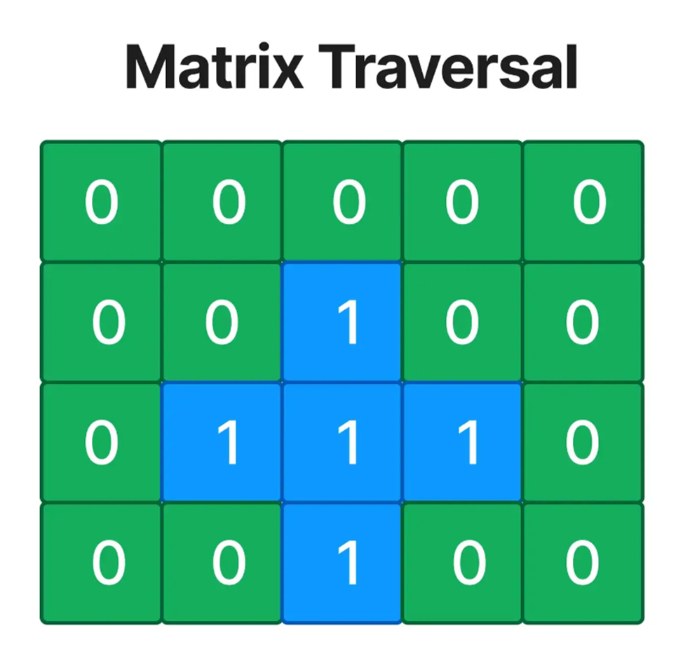
 
<b>Когда использовать</b>: при работе с двумерной сеткой (grid) или матрицой, островами, заливкой и т.п.

<b>Задачи</b>
- [num_islands](./matrix_traversal/num_islands.py) - возвращает кол-во островов
([LeetCode: 200](https://leetcode.com/problems/number-of-islands/description/))
- [surrounded_regions](./matrix_traversal/surrounded_regions.py) - заменяет окруженные регионы на 1
([LeetCode: 130](https://leetcode.com/problems/surrounded-regions/description/))

### Возврат (Backtracking)
Перебирает все возможные решения, откатываясь при неудаче.
 
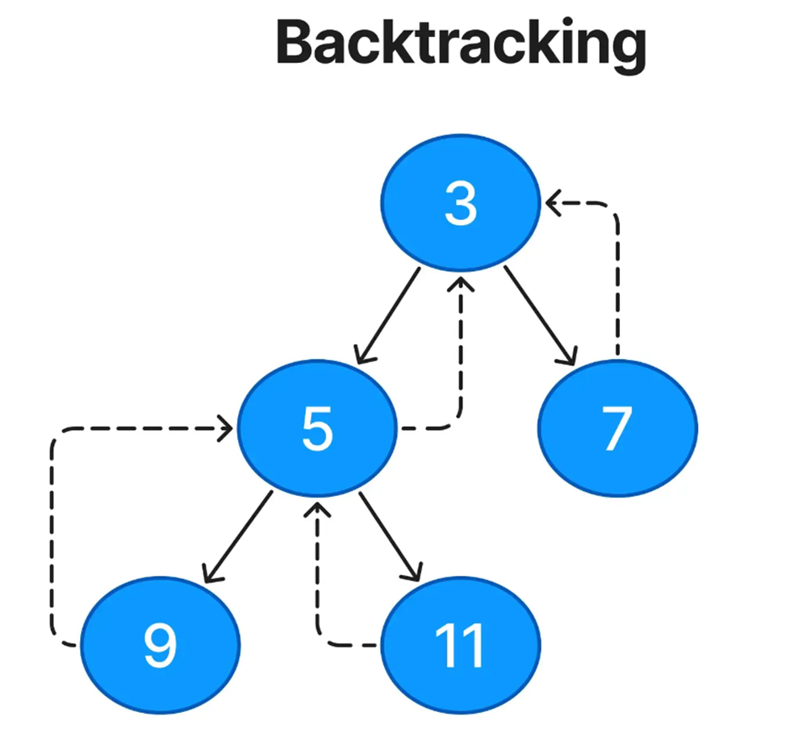
 
<b>Когда использовать</b>: для задач на перестановки, комбинации, размещения, судоку и т.д.

## Задачи
1. [two_sum](./two_sum.py) - поиск элементов в списке, сумма которых равна искомой.
2. [replace_bad_words](./replace_bad_words.py) - заменяет стоп-слова в тексте
3. [palindrome_number](./palindrome_number.py) - проверяет число палиндром
4. [roman_to_int](./roman_to_int.py) - переводит римское число в int
5. [longest prefix](./longest_prefix.py) - находит максимально общий префикс
6. [valid parentheses](./valid_parentheses.py) - проверяет корректность открытых/закрытых скобок
7. 